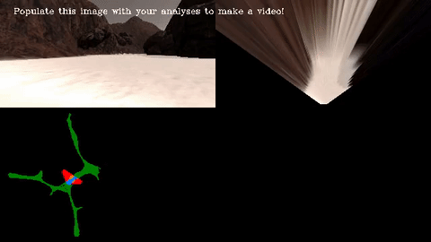

## Project: Search and Sample Return

[//]: # (Image References)

[image1]: ./misc/rover_image.jpg
[image2]: ./test_dataset/obstaclesample.jpg
[image3]: ./test_dataset/rocksample.jpg
[image4]: ./test_dataset/perspective_transform.png
[image5]: ./test_dataset/color_thresholding.png
[telemetry]: ./misc/telemetry.jpg
[perception]: ./misc/perception.jpg
[decision1]: ./misc/decision1.jpg
[decision2]: ./misc/decision2.jpg
[decision3]: ./misc/decision3.jpg
[decision4]: ./misc/decision4.jpg

![alt text][image1]

## [Rubric](https://review.udacity.com/#!/rubrics/916/view) Points
### Here I will consider the rubric points individually and describe how I addressed each point in my implementation.

#### 1. Provide a Writeup / README that includes all the rubric points and how you addressed each one.

I am submitting the writeup as markdown and You're reading it!

### Notebook Analysis
#### 1. Run the functions provided in the notebook on test images (first with the test data provided, next on data you have recorded). Add/modify functions to allow for color selection of obstacles and rock samples.

Here I have considered two images one for obstacle sample and rock sample as mentioned below and performed basic image processing like perpective transform, color thresholding and morphological operation as first step in perception algorithm.

Rock sample image

![alt text][image3]

Obstacle sample image

![alt text][image2]

In Perspective tranform step, I have used cv2 getPerspectiveTransform and warpperspective function as mentioned in the lesson for mapping purpose. Also, I have created mask image of Rover's field of view which will be later used for obstacle pixels in color thresholding step.

Perspective transform (top grid: Rock sample image, bottom grid: Obstacle sample image)

![alt text][image4]

In Color thresholding step, I have used basic thresholding operation to identify navigable pixels as well as rock sample pixels. Also, I have used cv2 inRange and bitwise_and to identify rock sample pixels. To enhance rock sample pixels, I have perfomed dilation morphological operation. For obstacle pixels, I have used warped mask image and subtract from navigable threshold image. Below we see for rock sample image (2nd and 3rd column), we are able to extract rock pixels after performing color thresholding. First column represents navigable terrain pixels and last column represents obstacle pixels in white.

Color thresholding (top grid: Rock sample image, bottom grid: Obstacle sample image)

![alt text][image5]

#### 2. Populate the `process_image()` function with the appropriate analysis steps to map pixels identifying navigable terrain, obstacles and rock samples into a worldmap.  Run `process_image()` on your test data using the `moviepy` functions provided to create video output of your result. 

In process_image() function, following steps I have performed to map pixels to idetify navigable terrain and obstacles into a worldmap and create video using moviepy function.

1) Define source and destination points for perspective transform
2) Apply perspective transform for mapping purpose and create warped mask image
3) Apply color threshold to identify navigable terrain/obstacles/rock samples
4) Convert thresholded image pixel values to rover-centric coords
5) Convert rover-centric pixel values to world coords
6) Update worldmap (to be displayed on left side of video)
7) Create output image consisting of original image, warped image and worldmap
8) Finally create video using moviepy function

### Autonomous Navigation and Mapping

#### 1. Fill in the `perception_step()` (at the bottom of the `perception.py` script) and `decision_step()` (in `decision.py`) functions in the autonomous mapping scripts and an explanation is provided in the writeup of how and why these functions were modified as they were.

Before explaning about perception step and decision step, I have made some modification in telemetry() and below is basic flowchart for telemetry(). The functions are defined in decision_step()

![alt text][telemetry]

rover_home_step() function is to initialize Rover's home location which is required while returning home and takes place one time. Also, update position required for stuck condition.

rover_stuck_step() function is to check Rover's is stuck at same position for more than 5sec. If true, set Rover.mode = 'stuck' and record the yaw angle such that Rover will induce 4-wheel turn until it exceeds 45 degree from previous recorded yaw angle. The rover rotates in left direction since wall crawling is right side. This needs to be changed if we set wall crawling to left side. Also, instead of checking Rover's same exact position, I have increased the radius to 0.3m such that Rover is checking approximate position. With more testing we can vary the parameter to increase the accuracy of stuck condition.

rock_sample_step() function is to check Rover has collected all rock samples and check whether Rover is within 5m of radius from home position. If true, set Rover.mode = 'return_home'. I have never worked on path finding algorithm but if we implement A star search algorithm or any other path finding algorithm, we can change the radius parameter for more accuracy.

limit_rover_max_vel_step() functionality to limit the speed of Rover to track revisited rock samples specifically in low light condition.

Below is the flowchart for perception_step()

![alt text][perception]

I have added dilation operation to enhance rock samples and reduce any false positive while detecting rock samples. To improve the fidelity, update world map only when Rover's roll and pitch is within 0.5 degree. With more testing we can vary the parameter to improve the fidelity overall. I have updated distances and angles individually for navigable terrain, rock samples and obstacles which will be utilized in decision_step to make necessary decsion. I have truncated the image of warped image to 10 pixels (5 pixels from middle section) and compute distances required for obstacle/wall avoidance. Again with more testing we can vary the parameter to improve the accuracy of obstacle/wall. All the necessary parameters are update in Rover object and pass it to decision_step().

Rover can either be from following 5 states:

(i)   stuck

(ii)  return_home 

(iii) forward

(iv)  stop

(v)   rock_detected

I have divided the decision_step() in four flowchart for better viewing purpose. Below is the flowchart when Rover's mode is either in stuck or return_home state.

![alt text][decision1]

When Rover is in stuck state, keep rotating until it exceeds 45 degree from previous recorded yaw angle in rover_stuck_step() function. 

When Rover is in return_home state, record total time and be in that state until the application is closed.

Below is the flowchart when Rover is in rock_detected state.

![alt text][decision2]

The main objective when Rover is in rock_detected state is to move effectively at velocity of 0.5m/s towards rock samples and when stuck may set throttle to 1 depending on the velocity of rover.

Below is the flowchart when Rover's mode is in forward state.

![alt text][decision3]

I have added one extra feature out here apart from udacity base code is when rover is stuck (velocity == 0) adjust the steer angle depending on navigable terrain angles to work smoothly or set throttle to 1.

Below is the flowchart when Rover's mode is in stop state.

![alt text][decision4]

I have added one extra feature out here apart from udacity base code is to steer cleverly.

#### 2. Launching in autonomous mode your rover can navigate and map autonomously.  Explain your results and how you might improve them in your writeup.  

I have posted a video online https://www.youtube.com/watch?v=x8kZY2MCl70 where Rover search and pick-up all rock samples and return home successfully. I am running Roversim on MacOS with screen resolution as 1024x768 and graphic quality as Good. 

Following are my conclusion with rover launching in autonomous mode:
1) Rover was able to navigate effectively in the direction of rock samples.
2) Rover was able to induce 4-wheel turn effectively.
3) Rover was able to come out of stuck state near wall or near obstacle or even sometime while collecting rock sample by incorporating 45 degree turn when rover is stuck at one place for more than 5 sec.
4) Rover was able to improve fidelity by updating map when Rover's roll and pitch is within 0.5 degree.
5) Rover was able to detect and avoid obstacles effectively by limiting the Rover's field of view.
6) Rover was effectively crawling towards right side of the wall to collect rock samples and avoid circular motion when navigable terrain is very wide.
7) Rover was effectively avoid wall crawling when navigable terrain is very narrow to avoid bumps and improve fidelity.
8) Rover was able to return home when Rover is within 5m of radius from home location.

Following are my conclusions where I can improve the code:
1) Rover can avoid the area where it has already mapped successfully and collected all rock samples.
2) Rover is unable to visit hidden places due to lack of light condition. Instead of considering RGB model, I can process the image in HSV model.
3) After couple of testing, I found out there is one place near home location where Rover moves in circular motion (even after wall crawling implementation) and was not able to exit the circular motion. Need to implement fitting based algorithm/RANSAC algorithm to collect all coordinates and identify whether Rover is moving in circular motion.
4) Also, need to implement path finding algorithm (A star search algorithm) to return home and collect rock samples.

In summary, I was able to meet the passing requirements (60% fidelity and 40% mapped) for the Rover's project. Overall it was fun and challenging.
